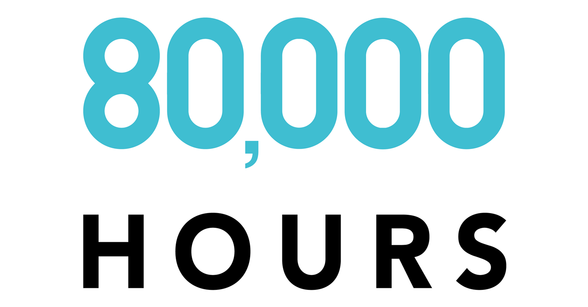

# Effective Altruism Natural Language Processing
Kaggle: 80,000 hours podcast transcripts

['80,000 hours Logo']

<h2>Pre-requisites ✔️: </h2>

```
pip install -r requirements.txt 
```

<h2>AUTHOR :black_nib: </h2>
- Nic Orchard @NicAOB97
